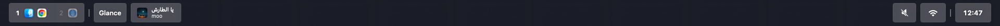
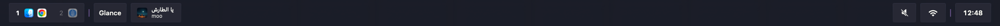
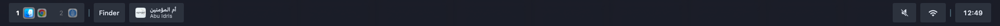
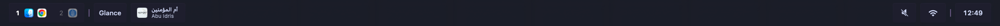
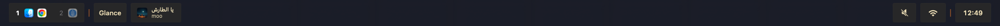
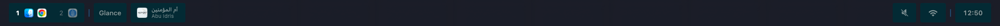
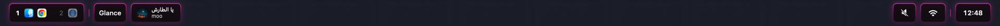
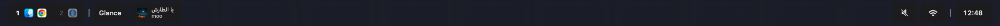
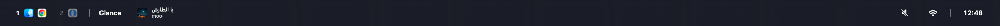

<p align="center">
  
</p>

<h1 align="center">Glance</h1>

<p align="center">
  Custom status bar for macOS. Replaces the boring default bar with something actually nice to look at.
</p>

<p align="center">
  
  
  
</p>

---

<p align="center">
  
</p>

https://github.com/user-attachments/assets/7a3114a6-12dc-42a6-87f0-127b7f67dc6d

## What is this

Glance is a status bar replacement for macOS. It sits at the top of your screen and shows you the stuff you actually care about: workspaces, current track, volume, Wi-Fi, battery, time. Everything is configurable through a simple TOML file or a Settings GUI.

Built with native Swift and SwiftUI. No Electron, no web views, no bloat.

## Features

- **Liquid Glass UI** with blur, gradient borders, glow, and shadows
- **11 built-in presets** so you can match your setup
- **Native macOS Spaces** out of the box (yabai and AeroSpace also supported)
- **Rich popups** for every widget: calendar with events, network speed, battery health, now playing with progress bar
- **TOML config** with live reload. Edit, save, see changes instantly
- **Settings GUI** if you don't want to touch config files
- **Window gap management** so maximized windows don't hide behind the bar
- **Launch at Login** via native macOS login items

## Widgets

| Widget | What it shows |
|--------|---------------|
| **Spaces** | Your workspaces with app icons. Click to switch |
| **Active App** | Name of the frontmost app |
| **Now Playing** | Current track, album art, progress bar, controls (Music & Spotify) |
| **Volume** | Speaker icon, scroll to adjust. Popup: slider + output device |
| **Network** | Wi-Fi/Ethernet status. Popup: signal, speed, IP, Tx Rate |
| **Battery** | Charge level. Popup: health %, cycles, temperature |
| **Time** | Customizable date/time. Popup: calendar grid + upcoming events |

Plus `spacer` and `divider` for layout.

## Presets

Pick one line in your config and the whole bar changes:

<table>
<tr>
<td align="center"><br/><b>Liquid Glass</b></td>
<td align="center"><br/><b>Frosted</b></td>
</tr>
<tr>
<td align="center"><br/><b>Tokyo Night</b></td>
<td align="center"><br/><b>Dracula</b></td>
</tr>
<tr>
<td align="center"><br/><b>Nord</b></td>
<td align="center"><br/><b>Catppuccin</b></td>
</tr>
<tr>
<td align="center"><br/><b>Gruvbox</b></td>
<td align="center"><br/><b>Solarized</b></td>
</tr>
<tr>
<td align="center"><br/><b>Neon</b></td>
<td align="center"><br/><b>Flat Dark</b></td>
</tr>
<tr>
<td align="center"><br/><b>Minimal</b></td>
<td></td>
</tr>
</table>

## Settings

No need to edit files if you don't want to. The Settings GUI covers presets, appearance tuning, widget order, and more.

<table>
<tr>
<td></td>
<td></td>
</tr>
</table>

### Settings in action

https://github.com/user-attachments/assets/bedb799d-f3ae-43ee-a64c-5f3034a5b422

### Switching presets

https://github.com/user-attachments/assets/66156dbe-6521-41b0-a465-234e8558d4c6

## Installation

### Download

Grab the latest `.dmg` from [Releases](https://github.com/azixxxxx/glance/releases), open it, drag **Glance.app** to `/Applications`. Done.

### Build from source

Requires Xcode 16+ and macOS 14.6+.

```bash
git clone https://github.com/azixxxxx/glance.git
cd glance

xcodebuild -project Glance.xcodeproj -scheme Glance -configuration Release \
  -derivedDataPath build build \
  CODE_SIGN_IDENTITY=- CODE_SIGNING_REQUIRED=NO CODE_SIGNING_ALLOWED=NO

cp -R build/Build/Products/Release/Glance.app /Applications/
open /Applications/Glance.app
```

## Configuration

Config lives at `~/.glance-config.toml`. It's created on first launch. Changes are picked up instantly.

```toml
theme = "dark"

# Switch preset and the whole look changes
preset = "liquid-glass"

# Or tweak individual values
# [appearance]
# roundness = 50          # 0 = square, 50 = capsule
# border-width = 1.0
# fill-opacity = 0.04
# foreground-color = "#ffffff"
# accent-color = "#ffffff"

[widgets]
displayed = [
    "default.spaces",
    "divider",
    "default.activeapp",
    "default.nowplaying",
    "spacer",
    "default.volume",
    "default.network",
    "divider",
    "default.time",
]

[widgets.default.time]
format = "E d MMM, H:mm"
calendar.format = "H:mm"
calendar.show-events = true

[widgets.default.battery]
show-percentage = true

[widgets.default.spaces]
space.show-key = true
window.show-title = true
```

### Available presets

`liquid-glass`, `frosted`, `flat-dark`, `minimal`, `neon`, `tokyo-night`, `dracula`, `gruvbox`, `nord`, `catppuccin`, `solarized`

### Date format

Uses ICU patterns: `E d MMM, H:mm` gives you `Thu 6 Mar, 17:14`. See [ICU Date Format Patterns](https://unicode-org.github.io/icu/userguide/format_parse/datetime/) for all options.

### Window managers

Works with native macOS Spaces by default. Also supports:

- **[yabai](https://github.com/koekeishiya/yabai)** via `yabai.path = "/opt/homebrew/bin/yabai"`
- **[AeroSpace](https://github.com/nikitabobko/AeroSpace)** via `aerospace.path = "/opt/homebrew/bin/aerospace"`

## Permissions

Glance asks for a few permissions on first launch:

| Permission | Why |
|------------|-----|
| **Accessibility** | So maximized windows leave a gap for the bar instead of hiding behind it |
| **Automation (Apple Events)** | To control Music and Spotify for the Now Playing widget |
| **Calendar** | To show upcoming events in the calendar popup |
| **Location** | To display Wi-Fi network name (macOS requires this for Wi-Fi info) |

All permissions are optional. The app works without them, you just lose the specific features.

## Requirements

- macOS 14.6 (Sonoma) or later
- Apple Silicon or Intel Mac

## Credits

Originally forked from [Barik](https://github.com/mocki-toki/barik) by mocki-toki. Rewritten and extended into a standalone project.

## License

[MIT](LICENSE)
